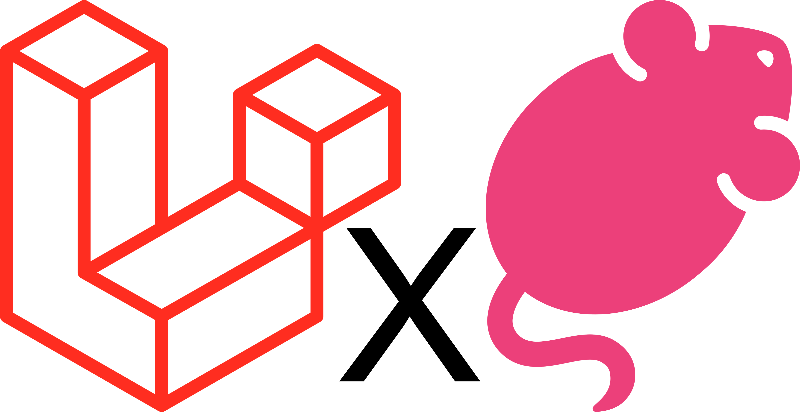
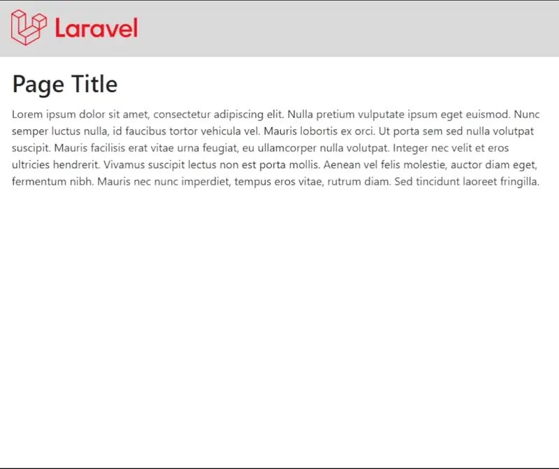

<p align="center">
    
</p>

# Laravel Tolgee Translator
[](https://packagist.org/packages/andreazorzi/laravel-tolgee-translator)
[](https://packagist.org/packages/andreazorzi/laravel-tolgee-translator)

This package simplifies the integration of <a href="https://tolgee.io/">Toglee</a> on Laravel by adding commands and blade directives.

## Installation
```bash
composer require andreazorzi/laravel-tolgee-translator
```

## Getting started
### Config
```php
/*
 * Tolgee service host
 */
'host' => env('TOLGEE_HOST', 'https://app.tolgee.io'),

/**
 * Your tolgee api key
 */
'api_key' => env('TOLGEE_API_KEY'),

/**
 * Tolgee project id
 */
'project_id' => env('TOLGEE_PROJECT_ID'),

/**
 * Default project language
 */
'locale' => env('TOLGEE_LOCALE', 'en'),

/**
 * Overwrite base locale translations files.
 */
'override' => env('TOLGEE_OVERRIDE', false),

/**
 * Accepted translation states. Check Tolgee documentation for available states.
 * Ex: REVIEWED,DISABLED,UNTRANSLATED,TRANSLATED
 */
'accepted_states' => explode(",", env('TOLGEE_ACCEPTED_STATES', 'REVIEWED')),

/*
 * Set a specific subfolder for language files
 * Ex: app/lang/{locale}/tolgee -> "tolgee"
 */
'lang_subfolder' => env('TOLGEE_LANG_SUBFOLDER'),
```

### Commands
#### Export Keys
```bash
php artisan tolgee:export-keys
```
Export all project translations keys and save them into tolgee project, existing keys will not be overwritten.

#### Delete Keys
```bash
php artisan tolgee:delete-keys
```
Delete all keys from the tolgee project.

#### Sync Translations
```bash
php artisan tolgee:sync-translations
```
Sync the translations from Tolgee to your local project

## Usage
To insert the translation into your project blade you can use the blade directive `@tolgee($key)`
```blade
@tolgee('pages.index.title')
```

If you want you can also get the translation by calling the the helper `tolgee($key)`
```php
tolgee('pages.index.title');
```

Those methods return the string on production environment and a html string on local environment.
The html string provide a direct link to the tolgee translation

<p align="center">
    
</p>